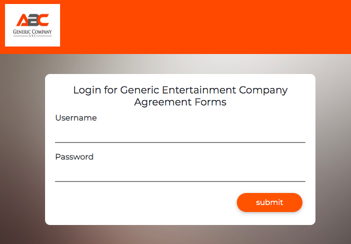
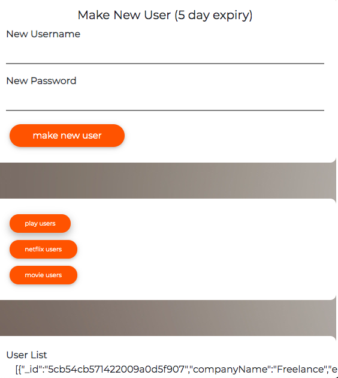
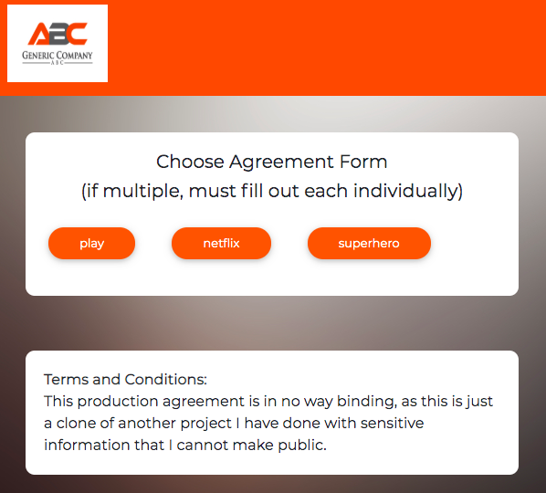
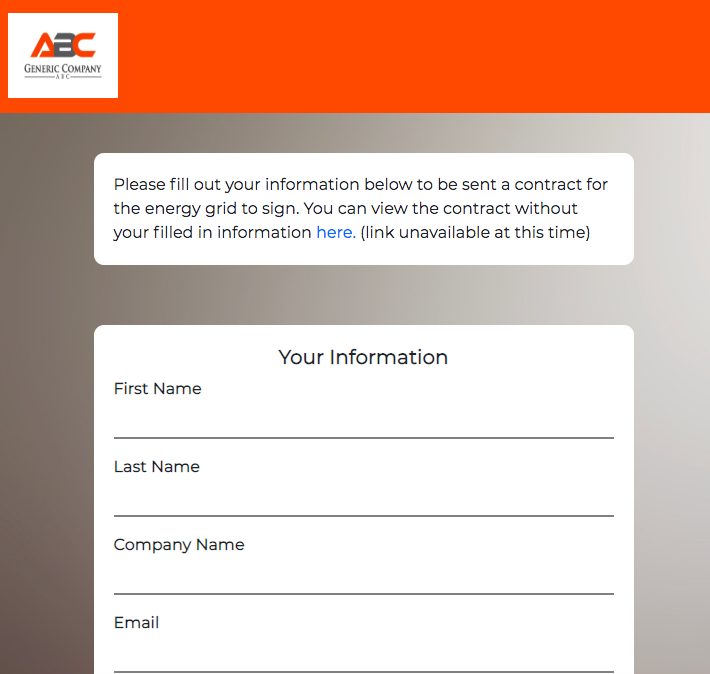

# Stealth Startup Project

## Live Site: [Producer Contracts](https://producer-contracts.herokuapp.com/)

### 1. Why / Background
  * Producer Contracts is a copy of project I did for a stealth startup company here in San Francisco. To keep the information in the original project secret, I changed the names and goal of the app from making contracts for something in the energy sector to making contracts for a hypothetical producer trying to make plays, TV shows, or movies. The application takes in a user's information via some forms and saves it in the MongoDB database, and a contract is automatically sent to the user with the user's information filled in via the Hellosign API.
  * The project was made to be secretive and secure so that the general public could not see the forms or the contracts being sent. I used React to accomplish this-- it's impossible (as far as I know) to see the underlying components in React in this case without having the correct credentials to log in.
 ### 2. What / Objectives / User Stories
  * **Technologies**, design through deployment of the application:
    * Server-side: Node.js w/ Express web app framework; MongoDB for data persistence w/ Sequelize ORM;  Passport for user authentication; Hellosign API for automated contracts
    * Client-side: React.js library for component based user interface; Material Bootstrap framework for HTML/CSS; React-Datepicker and Moment.js for dates in contracts
  * **User stories**:
    * To be able to receive a contract with the form info put in automatically filled
    * The owner of the app stores all user's information in their database and can access it through the app
### 3. How / Design Description
  * **Functionality** - refer to [video of application user flow (still working on it)](#):
    * View Setup (/client)
      * Login
      

      * Admin page
      

      * Form Choice page
      
      
      * Top of each Form page
      

  * Instructions for using the application are in the front page of the live application.

  * If you would like to install this locally, download, yarn install, and sign up for a Hellosign API key. Put your api key in a .env file like the .env.example.txt. Make 3 templates on Hellosign, and replace the template ids with the ones in apiRoutes.js. Then for each Hellosign template you have to put the variables exactly as they are in the defaultForm.js, playForm.js, netflixForm,js, and movieForm.js (the "name" ones) as text boxes in Hellosign document edit, and choose filled by as "Me when sending" with the exact variable in the "Field Label" section. Make sure to use the defaultForm values for all 3 forms. Also, each form needs a "currentDate field" that it gets from Home.js (it is the date the document is sent and is automatic with Moment.js).

## Versioning
  * For the versions available, see the tags on this repository.
## Authors
  * Orion Abrams
## License
  * This project is licensed under the [MIT License](LICENSE).
## Acknowledgments
  * Thanks to David Hallinan, my exceptional coding teacher, and to my supportive family to help get me this far.